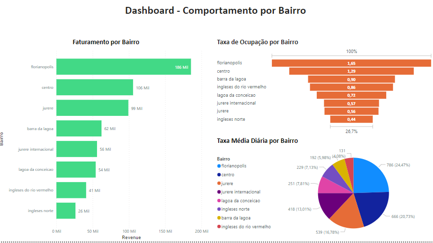
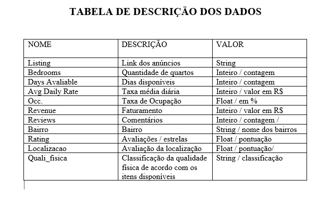

# Desafio proposto pela Seazone - Estágio em Análise de Dados.

# Análise de anúncios do Airbnb 

## Roteiro para o Desafio
Semanalmente, definimos uma nova cidade dentro de uma região para a análise. A análise é feita por meio da busca de anúncios de apartamentos 
para aluguel de temporada que apresentam consistência em seus dados. As principais informações para os anúncios selecionados são o
faturamento, o preço, a taxa de ocupação e a localidade. Também é importante classificar os apartamentos quanto à sua proximidade de
atrativos e qualidade física. Sendo assim, utilizando a Planilha de Anúncios elabore uma planilha de classificação dos anúncios da cidade
com o objetivo de entender o comportamento de cada bairro, considerando o seguinte:
- Devem ser considerados apenas os anúncios com pelo menos 200 dias disponíveis e 20 reviews;
- Classificar os anúncios de acordo com o bairro;
- Classificar os anúncios quanto à sua atratividade, criando categorias referentes à proximidade com atrativos / localização;
- Definir um segundo critério de classificação referente à qualidade física do apartamento (Ex.: qualidade da mobília, área de lazer);
- A classificação deve ser padronizada, utilizando validação de dados Organizar a planilha da melhor forma possível, utilizando formatação
condicional, filtros, validação de dados e outros recursos que achar necessário;
- Filtrar dentre os anúncios, aqueles que considera mais relevantes em cada bairro, considerando além do faturamento, preço e ocupação, os critérios estabelecidos;
- Criar um dashboard ou relatório apresentando um resumo do comportamento de cada bairro quanto aos parâmetros de faturamento, preço e ocupação, levando em consideração apenas os
anúncios filtrados no tópico anterior, organizados de forma que faça sentido e com uma análise geral explicitando quais os bairros mais e
menos atrativos.

